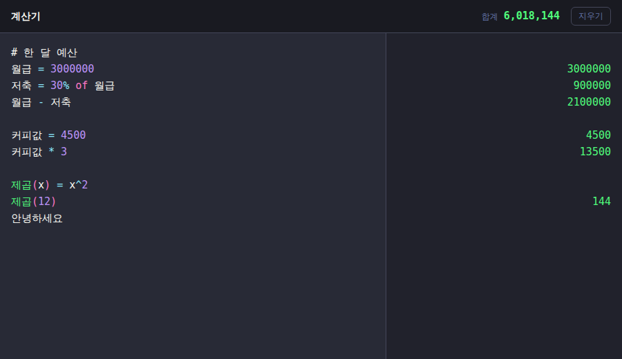

# calc

줄 단위로 식을 적으면 바로 결과를 계산해 주는 노트패드형 계산기입니다.
[Soulver](https://soulver.app/) · [Numi](https://numi.app/)에서 영감을 받았습니다.



## 특징

- **노트패드 방식** — 왼쪽 에디터에 여러 줄을 적으면 오른쪽에 줄마다 결과가 나옵니다.
- **변수** — 값을 변수에 담아 다음 줄에서 재사용합니다.
- **줄 참조** — 각 줄의 결과가 `line1`, `line2` ... 로 노출되어 이전 줄 결과를 바로 참조할 수 있습니다.
- **한글 변수·함수명** — `월급 = 3000000`, `제곱(x) = x^2` 처럼 한글 식별자를 그대로 씁니다.
- **단위 변환** — `3 km to m`, `1 hour in minutes` 등.
- **통화 변환** — `10 USD to KRW`, `2 EUR + 3 EUR` (환율은 고정 스냅샷 값, 아래 참고).
- **백분율** — `20% of 50`, `100 + 10%` 같은 자연어 표현.
- **합계** — 숫자 결과들의 합을 헤더에 실시간 표시(단위 값은 제외).
- **클릭 복사** — 결과를 클릭하면 클립보드로 복사됩니다.
- **자동 저장** — 입력이 브라우저에 저장되어 새로고침해도 유지됩니다.
- **다크/라이트 테마** — 시스템 설정(`prefers-color-scheme`)을 따릅니다.

## 문법

| 입력 | 결과 |
| --- | --- |
| `1 + 2 * 3` | `7` |
| `price = 100` | `100` |
| `price * 1.1` | `110` |
| `2 + 3`<br>`line1 * 10` | `5`<br>`50` |
| `월급 = 3000000`<br>`30% of 월급` | `3000000`<br>`900000` |
| `제곱(x) = x^2`<br>`제곱(12)` | _(빈칸)_<br>`144` |
| `3 km to m` | `3000 m` |
| `10 USD to KRW` | `13698.63... KRW` |
| `20% of 50` | `10` |
| `100 - 10%` | `90` |

- 빈 줄, `#` 또는 `//`로 시작하는 주석, 계산할 수 없는 텍스트는 결과가 빈칸으로 표시됩니다.
- 계산 엔진은 [math.js](https://mathjs.org/)를 사용하므로 math.js가 지원하는 함수·상수·단위를 모두 쓸 수 있습니다.

## 개발

요구사항: Node.js 20+ 와 Yarn.

```bash
yarn install     # 의존성 설치
yarn dev         # 개발 서버 실행
yarn build       # 타입체크 + 프로덕션 빌드 (dist/)
yarn serve       # 빌드 결과 미리보기
yarn typecheck   # 타입체크만 실행
```

## 기술 스택

- [React](https://react.dev/) 19 + [TypeScript](https://www.typescriptlang.org/) 5
- [Vite](https://vite.dev/) 7
- [math.js](https://mathjs.org/) — 식 평가
- [react-simple-code-editor](https://github.com/react-simple-code-editor/react-simple-code-editor) + [Prism](https://prismjs.com/) — 에디터 하이라이팅

## 참고

- **환율은 고정 스냅샷 값**입니다. 오프라인 동작을 우선하여 `src/helpers/currency.ts`에
  기준값을 두었습니다. 실시간 환율이 필요하면 이 값을 API 연동으로 교체하면 됩니다.
- 앞으로 이어갈 작업은 [`TODO.md`](TODO.md)에 정리해 두었습니다.
